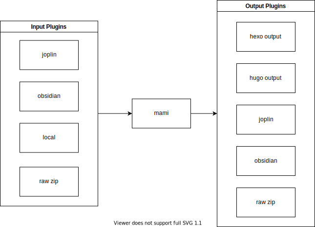

# mami: cross-tool document converter

## Introduction

mami is a conversion tool that can connect different markdown-based frameworks and tools, and can convert the data of one tool to another tool, which is very helpful for cross-application migration and multi-platform release, currently supports `joplin/obsidian /hexo/hugo/raw`, plans to support `docsify/vuepress`.

## Usage

> Requirements
>
> - you need to install [nodejs 18](https://nodejs.org/en/download/)

### Step 1: Create a new project

> The following uses pnpm as the package manager, but you can replace it with npm

Create a new directory and enter

```sh
mkdir mami-starter && cd mami-starter
```

Then use your favorite package manager to initialize

```sh
pnpm init
```

### Step 2: Install mami

Add @mami/cli and typescript as development dependencies of the project

```sh
pnpm i -D @mami/cli typescript
```

Add some scripts to `package.json`

```json
{
  ...
  "scripts": {
    "gen": "mami"
  },
  ...
}
```

Create your config file `mami.config.ts`

```ts
import { defineConfig } from '@mami/cli'

export default defineConfig({
  input: [],
  output: [],
})
```

then run

```sh
$ pnpm run gen

> joplin2obsidian-demo@1.0.0 gen
> mami

start
end
```

Well, nothing happens because you have no input or output plugin defined. Continue to the next step.

### Step 3: Install the required plugins

Install the required plug-ins to connect the required tools. Here we use joplin => obsidian as an example

```ts
pnpm i -D @mami/plugin-joplin @mami/plugin-obsidian
```

Modify your config file `mami.config.ts`

> The token required by the joplin plugin here comes from the [web clipper service](https://joplinapp.org/clipper/#troubleshooting-the-web-clipper-service)

```ts
import { defineConfig } from '@mami/cli'
import * as joplin from '@mami/plugin-joplin'
import * as obsidian from '@mami/plugin-obsidian'
import path from 'path'

export default defineConfig({
  input: [
    joplin.input({
      baseUrl: 'http://127.0.0.1:41184',
      token:
        '5bcfa49330788dd68efea27a0a133d2df24df68c3fd78731eaa9914ef34811a34a782233025ed8a651677ec303de6a04e54b57a27d48898ff043fd812d8e0b31',
      tag: '',
    }),
  ],
  output: [
    obsidian.output({
      root: path.resolve(__dirname, 'dist'),
    }),
  ],
})
```

### Step 4: Perform the conversion

Then you can rerun the following command

```sh
pnpm run gen
```

Now you will see the converted obsidian file in dist

> [example](https://github.com/rxliuli/mami/tree/master/demos/joplin2obsidian-demo)

## plugins

> [API Documentation](https://paka.dev/npm/@mami/cli@latest/api)

Roughly speaking, plugins are divided into input and output plugins. The input plugin will return an [AsyncGenerator](https://developer.mozilla.org/en-US/docs/Web/JavaScript/Reference/Global_Objects/AsyncGenerator), while the output plugin will return an AsyncGenerator will consume it in the `handle hook` function.



Intermediate format

```json
{
  "id": "0e2510c9272449dbafe3e0f3fba12d74",
  "title": "Welcome to Joplin!",
  "content": "content body",
  "createAt": 1666288266591,
  "updateAt": 1666288266591,
  "path": ["Welcome! (Desktop)"],
  "tags": [
    {
      "id": "04dfa5cf19e4435f9f3f09a73a7edfb2",
      "title": "blog"
    }
  ],
  "resources": [
    {
      "id": "63b83e548b7b4adfae18544b7038b0bc",
      "title": "AllClients.png",
      "raw": "<nodejs buffer>"
    }
  ]
}
```

Writing plugins involves some markdown ast operations. For example, you may need to convert links in markdown. It is recommended to use [mdast](https://github.com/syntax-tree/mdast) to handle it.

## Motivation

Why started this rewrite?

The main reason is that some frameworks are currently supported, but it is still not enough. In my case, I have come into contact with the vitepress documentation generator. I plan to use it to replace vuepress, but this requires some modifications to joplin-blog, which actually does not not very convenient. Some people have also mentioned how to generate more customized files, such as adding additional yaml meta information to the generated markdown (ref: <https://github.com/rxliuli/joplin-utils/issues/55>), which It's actually a bit cumbersome without extension points, the temporary solution given at that time was to use joplin-blog in the form of a lib, and insert some custom logic to do it. There is also mention of supporting hugo, but it is not shown that all is implemented in joplin-blog.

Later, I realized that a plugin system is needed to support generating arbitrary framework files, and further, I can even add input sources such as joplin as plugins, just like pandoc, to connect different note-taking, blogging and wiki tools. One of the current attempts is mami, which intends to use markdown as an intermediate format for conversion.
At present, this project has just been created, and only supports joplin as input source and hexo/local-dir as output source, but I have already used it in my own blog, reference: <https://github.com/rxliuli/blog/ blob/master/mami.config.ts>

> PS: The origin of the name mami is [Mami Tomoe] in Puella Magi Madoka Magica (https://en.wikipedia.org/wiki/Mami_Tomoe), her magic is a **ribbon** that can connect various things , and can even form a musket (:
