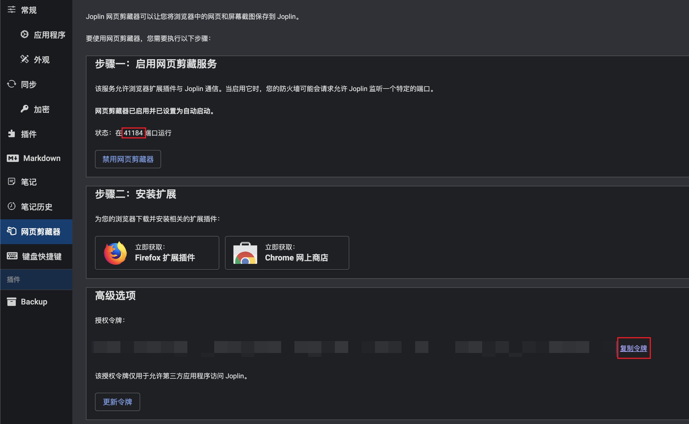

# 笔记 => 博客

> [必要条件](./book.md#必要条件)

## 前提

> 下面使用 [joplin](https://joplinapp.org/) 作为笔记工具，[hexo](https://hexo.io/) 作为博客进行说明。但这两者都可以替换，例如笔记的来源可以替换为 obsidian，输出的博客则可以替换为 hugo。

1. 首先，确保 joplin 已经开启了 web clipper。
   
2. 其次，需要一个 hexo 项目，如果已有，请参考 [连接 joplin 到现有的 hexo 博客](#连接-joplin-到现有的-hexo-博客)，否则继续下一步。

## 从零开始创建 hexo 博客

如果你还没有 hexo blog，那么可以直接使用模版创建来减少配置。

1. 在 github 上使用模版项目 [joplin-hexo-demo](https://github.com/mark-magic/joplin-hexo-demo) 创建一个新的项目，操作路径 **Use this template > Create a new repository**。如果还没有 github 账户，请 [注册](https://github.com/signup) 一个。
2. 使用 git 在命令行克隆你的项目到本地 `git clone https://github.com/<username>/<repo>.git`
3. 修改 mark-magic.config.yaml 配置文件中的 `baseUrl` 和 `token` 为 joplin 设置中的值
4. 在 joplin 中为你希望发布的笔记添加 `blog` 标签
5. 运行命令 `npx mark-magic && npx hexo server`，打开 <http://localhost:4000/joplin-hexo-demo/> 可以看到你的笔记了
   
6. 现在修改 \_config.yml 配置文件中 `root` 的值为你克隆的 github `<repo>` 的名字
7. 在 github 的存储库设置中的 **Pages** 菜单项下，选择 **Build and deployment > Source** 中的 **GitHub Actions**。
8. 最后运行 `npm run commit` 推送所有要发布的笔记内容。

等待 GitHub Actions 完成，可以在 `https://github.com/<username>/<repo>/actions` 查看进度。

一切完成后，应该可以看到站点被部署在 `https://<username>.github.io/<repo>/` 或 `https://<custom-domain>/`，具体取决于设置。

> 示例项目可以在 <https://github.com/mark-magic/joplin-hexo-demo> 看到。

## 连接 joplin 到现有的 hexo 博客

1. 安装依赖 `npm i -D @mark-magic/cli @mark-magic/plugin-joplin @mark-magic/plugin-hexo`
2. 添加配置 `mark-magic.config.yaml`

   ```yaml
   # mark-magic.config.yaml
   tasks:
     - name: blog
       input:
         name: '@mark-magic/plugin-joplin' # 输入插件，从 joplin 笔记中读取数据
         config:
           baseUrl: 'http://localhost:27583' # joplin web clipper service 的地址，一般是 http://localhost:41184，这里演示使用了开发时的 http://localhost:27583
           token: '5bcfa49330788dd68efea27a0a133d2df24df68c3fd78731eaa9914ef34811a34a782233025ed8a651677ec303de6a04e54b57a27d48898ff043fd812d8e0b31' # joplin web clipper service 的 token
           tag: blog # 根据标签过滤笔记
       output:
         name: '@mark-magic/plugin-hexo' # 输出插件，生成 hexo 需要的文件
         config:
           path: './' # hexo 项目的根目录
           base: /joplin-hexo-demo/ # 部署时的 baseUrl，默认部署在域的根路径，应该与 hexo _config.yml 中的 root 配置保持一致
   ```

3. 修改 hexo 的配置 `_config.yml`，如果包含

   ```yaml
   permalink: /p/:abbrlink/
   ```

4. 从 joplin 读取笔记生成 hexo blog 所需要的文件

   ```sh
   npx mark-magic # 这会清空 source/_posts 和 source/resources 目录，如果有什么文件请备份
   ```

完成后你可以在 `source/_posts` 和 `source/resources` 目录看到生成的文件，现在可以继续使用 hexo 构建和发布了。
