# Plugin API

If there is currently no suitable plugin, you can create a plugin following these steps. A plugin is simply a regular npm package that exports functions that comply with specific specifications.

## Concepts

An input plugin reads external data and transforms it into a unified Content stream, while an output plugin transforms a Content stream into a specific output. Content is key to the flow of data between plugins and abstracts the data format between plugins.



The Content may also contain a series of Resources, which are part of the Content but not necessary. For example, the Content may be an article, while the Resources are the images referenced in the article. Here is the complete type definition:

```ts
interface Data {
  /** The unique identifier of the data */
  id: string
  /** The name of the data */
  name: string
  /** The creation time */
  created: number
  /** The update time */
  updated: number
  /** Possible additional data */
  extra?: any
}

/** Anything apart from the content is considered a resource */
export interface Resource extends Data {
  /** The binary representation of the resource */
  raw: Buffer
}

/** The content file */
export interface Content extends Data {
  /** The text content, the format is not the actual concern */
  content: string
  /** The path of the file, used for directory structure, including the file name itself, for example: books/01/001.md */
  path: string[]
  /** The resources referenced in the content, duplicated resources can point to the same one */
  resources: Resource[]
}
```

## Writing Plugins

A basic plugin is an npm package that exports multiple functions, where each function corresponds to `input/transform/output` in the plugin's `mark-magic.config.yaml` configuration file. At runtime, the functions are invoked with the corresponding configuration. You can quickly create a plugin using `pnpm create @mark-magic/plugin <plugin-name>`. You can find more real examples of plugins in the [mark-magic project](https://github.com/mark-magic/mark-magic/tree/main/packages).

### Input Plugins

The `generate` function of an input plugin is an asynchronous iterator that returns a Content object for each iteration. Here is the type definition:

```ts
/** Input plugin */
export interface InputPlugin {
  /** The name */
  name: string
  /** Asynchronous iterator that generates a stream of content files */
  generate(): AsyncGenerator<Content>
}
```

Basic example:

```ts
// src/index.ts
import { InputPlugin } from '@mark-magic/core'

export function input(options: {}): InputPlugin {
  return {
    name: 'xxx',
    async *generate() {
      // TODO
    },
  }
}
```

### Transform Plugins

The `transform` function is the main function of a transform plugin. It takes a Content object as input and must return a Content object. You can modify the Content object as needed within the function and return it. There are also two hook functions, `start` and `end`, which are called at the beginning and end of the task respectively.

```ts
/** Transform plugin, does not take any input or produce any output, only performs transformations on Content objects in the stream */
export interface TransformPlugin {
  name: string
  start?(): Promise<void>
  /** The transform function */
  transform(content: Content): Promise<Content>
  end?(): Promise<void>
}
```

Basic example:

```ts
// src/index.ts
import { OutputPlugin } from '@mark-magic/core'

export function transform(options: {}): OutputPlugin {
  return {
    name: 'xxx',
    async start() {
      // TODO
    },
    async handle(content) {
      // TODO
    },
    async end() {
      // TODO
    },
  }
}
```

### Output Plugins

The `handle` function is the main function of an output plugin. It takes a Content object as input and processes it accordingly. There are also two hook functions, `start` and `end`, which are called at the beginning and end of the task respectively.

```ts
/** Output plugin */
export interface OutputPlugin {
  /** The name */
  name: string
  /** The start hook function */
  start?(): Promise<void>
  /** Handles each content and its dependent resources */
  handle(content: Content): Promise<void>
  /** The end hook function */
  end?(): Promise<void>
}
```

Basic example:

```ts
// src/index.ts
import { OutputPlugin } from '@mark-magic/core'

export function output(options: {}): OutputPlugin {
  return {
    name: 'xxx',
    async start() {
      // TODO
    },
    async handle(content) {
      // TODO
    },
    async end() {
      // TODO
    },
  }
}
```

## Publishing Plugins

To publish a plugin, simply publish it as an npm package. There is no specific requirement for the name, but it is recommended to use the format `mark-magic-plugin-xxx`, for example `mark-magic-plugin-joplin`, for easier searching in the future.
