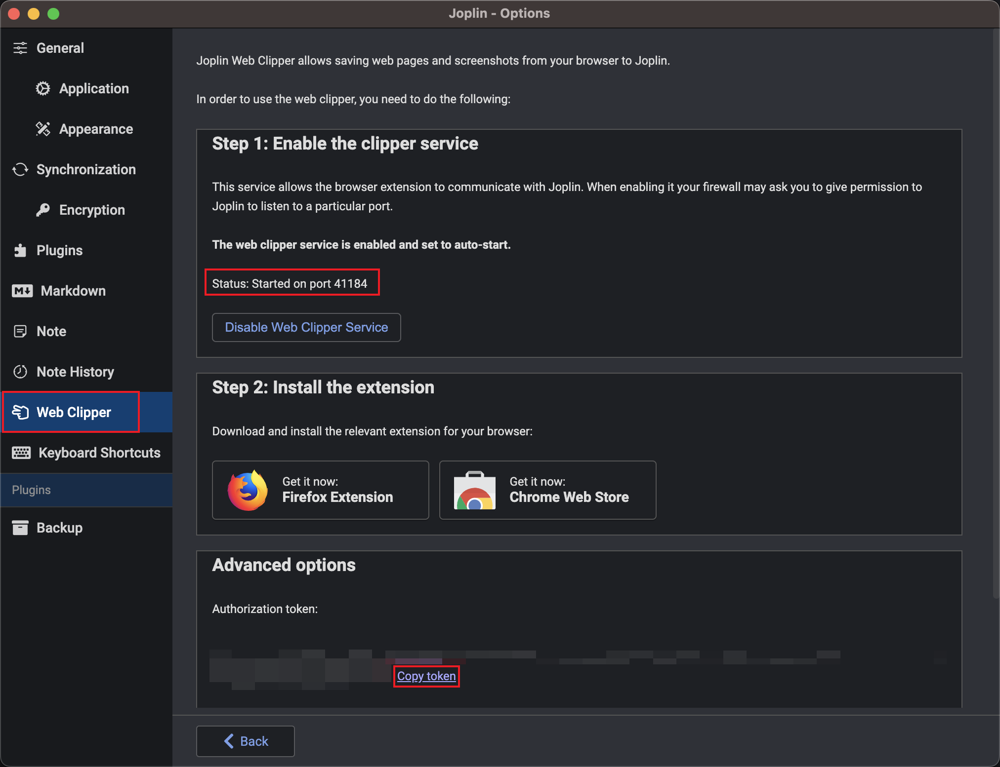
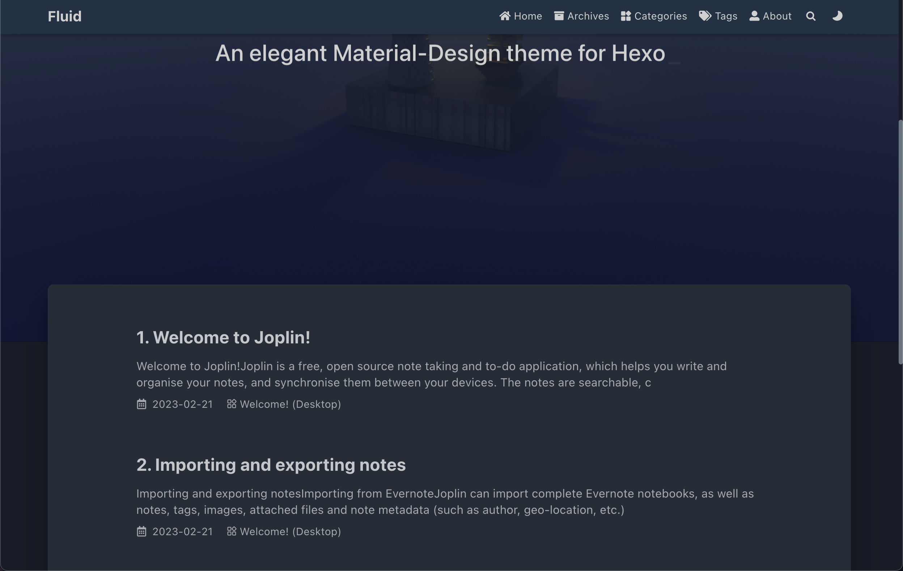

# Notes => Blog

## Prerequisites

> The following instructions use [joplin](https://joplinapp.org/) as the note-taking tool and [hexo](https://hexo.io/) as the blogging platform. However, both can be replaced. For example, you can use Obsidian as the note source and Hugo as the blogging platform.

1.  First, make sure that joplin's web clipper is enabled.
    
2.  Next, you will need a hexo project. If you already have one, please refer to [Connecting Joplin to an Existing Hexo Blog](#Connecting-Joplin-to-an-Existing-Hexo-Blog). Otherwise, continue to the next step.

## Creating a Hexo Blog from Scratch

If you don't have a hexo blog yet, you can create one using a template to reduce the configuration steps.

1.  Create a new project on GitHub using the template project [joplin-hexo-demo](https://github.com/mark-magic/joplin-hexo-demo). Follow this path: **Use this template > Create a new repository**. If you don't have a GitHub account yet, please [sign up](https://github.com/signup).
2.  Clone your project to your local machine using git command line: `git clone https://github.com/<username>/<repo>.git`
3.  Modify the `baseUrl` and `token` in the mark-magic.config.yaml configuration file with the values from your joplin settings.
4.  Add the `blog` tag to the notes you want to publish in joplin.
5.  Run the command `npx mark-magic && npx hexo server`. Open <http://localhost:4000/joplin-hexo-demo/> to view your notes.
    
6.  Update the `root` value in the \_config.yml configuration file to the name of your cloned GitHub repo.
7.  In the GitHub repository settings, navigate to **Pages** and choose **Build and deployment > Source** and select **GitHub Actions**.
8.  Finally, run `npm run commit` to push all the notes you want to publish.

Wait for GitHub Actions to complete. You can check the progress at `https://github.com/<username>/<repo>/actions`.

Once everything is complete, your site should be deployed at `https://<username>.github.io/<repo>/` or `https://<custom-domain>/` depending on your settings.

> You can see an example project at <https://github.com/mark-magic/joplin-hexo-demo>.

## Connecting Joplin to an Existing Hexo Blog

1.  Install the dependencies: `npm i -D @mark-magic/cli @mark-magic/plugin-joplin @mark-magic/plugin-hexo`

2.  Add the configuration file `mark-magic.config.yaml`

    ```yaml
    # mark-magic.config.yaml
    tasks:
      - name: blog
        input:
          name: '@mark-magic/plugin-joplin' # Input plugin to read from joplin notes
          config:
            baseUrl: 'http://localhost:27583' # Address of joplin web clipper service, usually http://localhost:41184, but here we use http://localhost:27583 for demonstration purposes
            token: '5bcfa49330788dd68efea27a0a133d2df24df68c3fd78731eaa9914ef34811a34a782233025ed8a651677ec303de6a04e54b57a27d48898ff043fd812d8e0b31' # Token for joplin web clipper service
            tag: blog # Filter notes based on tag
        output:
          name: '@mark-magic/plugin-hexo' # Output plugin to generate files for hexo
          config:
            path: './' # Root directory of the hexo project
            base: /joplin-hexo-demo/ # baseUrl when deployed, by default it is deployed at the root path of the domain, should match the root configuration in hexo _config.yml
    ```

3.  Modify the hexo configuration file `_config.yml`, if it contains

    ```yaml
    permalink: /p/:abbrlink/
    ```

4.  Read the notes from joplin and generate the required files for the hexo blog

    ```sh
    npx mark-magic # This will empty the source/_posts and source/resources directories, so please backup any files if necessary
    ```

After completion, you will see the generated files in the `source/_posts` and `source/resources` directories. You can now continue with building and publishing your hexo blog.
