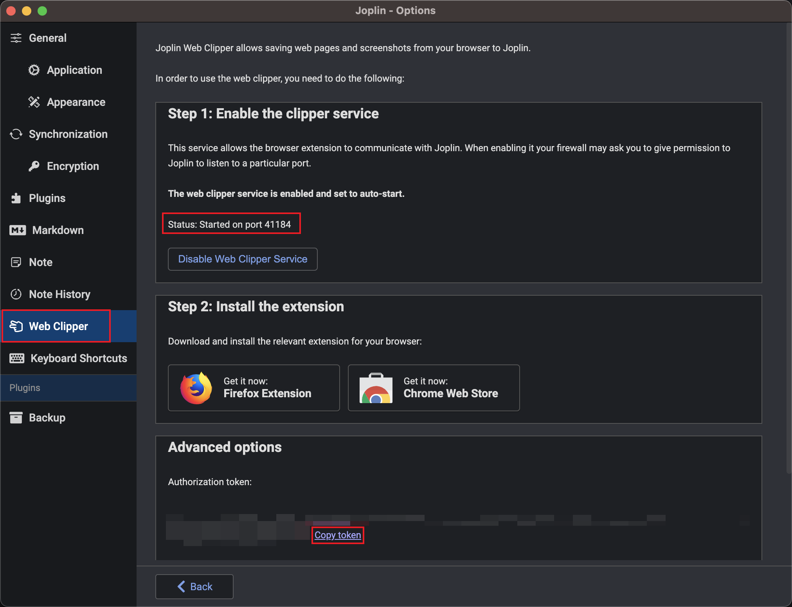

# plugin-joplin

Input plugin that uses Joplin notes as a data source.

## input

```yaml
# mark-magic.config.yaml
tasks:
  - name: blog
    input:
      name: '@mark-magic/plugin-joplin'
      config:
        baseUrl: 'http://localhost:41184'
        token: ''
        tag: blog
```

### baseUrl

The address of the Joplin web clipper service, usually `http://localhost:41184`, which can be found in **Settings => Web Clipper**.



### token

The token of the Joplin web clipper service, which can be copied from Joplin.

### tag

Filter notes by tag. For example, when publishing a blog, it can be configured as `blog` to only publish notes with the `blog` tag. If specified as `''`, no filtering will be applied, and all notes will be used as the data source.
